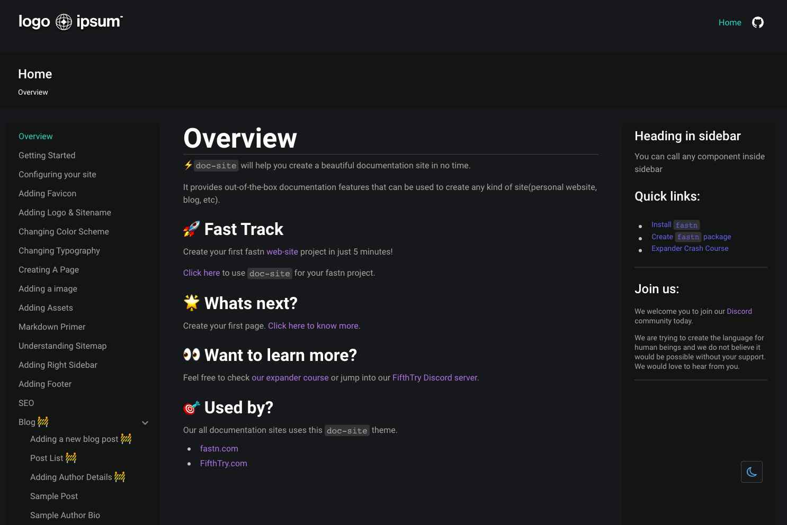

**This is a repository which I made when I took part in a conference by a company named "Fifth Try", you can check them out [here](https://www.fifthtry.com/).** 

*They provide an easier way and a more developer friendly way of making websites for those who don't really want to become a full stack developer themselves and want to make a customized personal, portfolio or startup website on their own in a hassle-free manner.*

# Overview

[doc-site](https://fastn-community.github.io/doc-site/) will help you create
a beautiful documentation site in no time.

It provides out-of-the-box documentation features that can be used to create any
kind of site(personal website, blog, etc).

# Preview

## Get Rolling

[Click here](https://fastn-community.github.io/doc-site/) to learn how to use this template.

# [Dive into the Docs](https://fastn-community.github.io/doc-site/)

# See it in Action!

Explore websites and projects that have utilized this component/template 
**[here](https://fastn-community.github.io/doc-site/#dart-used-by)** for
inspiration.

## fastn and Curious?

Discover more of fastn here.

- [Expander Crash Course](https://fastn.com/expander/)
- [Video Tutorials](https://fastn.com/expander/hello-world/-/build/)
- [Explore more Templates/ Components/ Package](https://fastn.com/featured/)

## Become a fastn Contributor

1.  Finish the [Expander Crash Course](https://fastn.com/expander/)
2.  Share your progress and ideas on [Discord](https://discord.gg/bucrdvptYd).
3.  Let our team guide you on your contributor journey.

## Become a fastn-trailblazer

- [Join our Discord Server](https://discord.gg/bucrdvptYd) to connect with other fastn enthusiasts and stay up to date with the latest developments.
- [Star us on GitHub](https://github.com/fastn-stack/fastn/)
